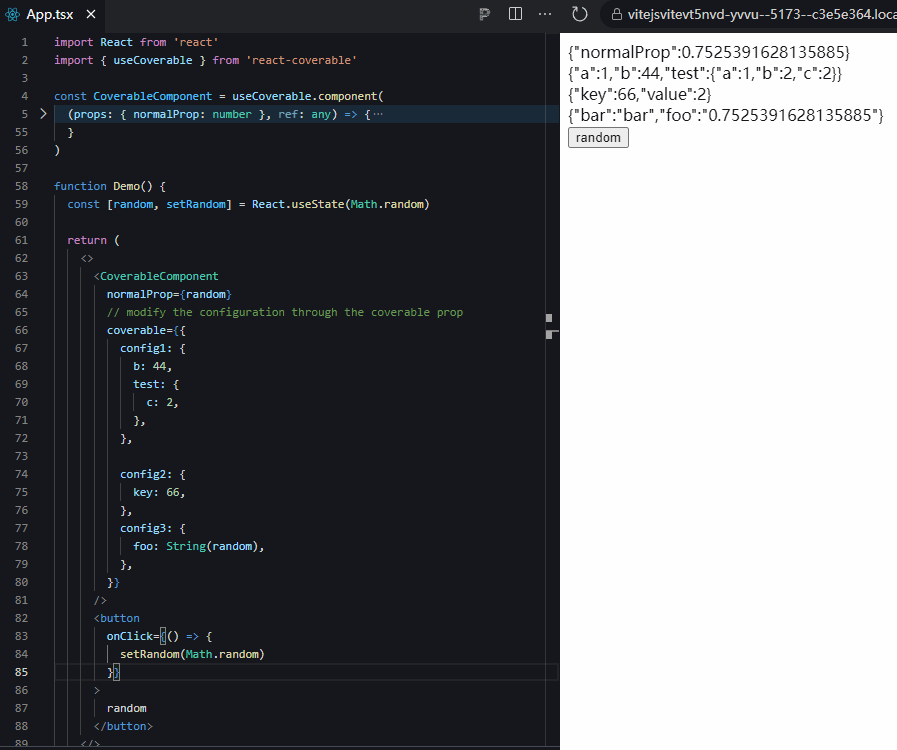

# react-coverable

[](https://npmjs.org/package/react-coverable)
[](https://bundlephobia.com/result?p=react-coverable@latest)


Write rewritable react component props to make complex components customizable

## Demo

[](https://stackblitz.com/edit/vitejs-vite-vt5nvd?file=src%2FApp.tsx)



## Usage

```tsx
import React from 'react'
import { useCoverable } from 'react-coverable'

const CoverableComponent = useCoverable.component(
  (props: { normalProp: number }, ref: any) => {
    const config1 = useCoverable({
      a: 1,
      b: 2,
      // custom rewrite process
      test: useCoverable.value({
        // default value
        default: {
          a: 1,
          b: 2,
        },
        // configuration item, only used to extract types
        config: {
          c: 3,
          d: 2,
        },
        // the process of merging configuration items and default values
        onCovered: (current, config) => {
          return {
            ...current,
            ...config,
          }
        },
      }),
    })

    const config2 = useCoverable({
      key: 1,
      value: 2,
    })

    const config3 = useCoverable({
      bar: 'bar',
      foo: 'foo',
    })

    return useCoverable
      .props({
        config1,
        config2,
        config3,
      })
      .render(() => (
        <>
          <div>{JSON.stringify(props)}</div>
          <div>{JSON.stringify(config1?.getConfig())}</div>
          <div>{JSON.stringify(config2?.getConfig())}</div>
          <div>{JSON.stringify(config3?.getConfig())}</div>
        </>
      ))
  },
)

function Demo() {
  const [random, setRandom] = React.useState(Math.random)

  return (
    <>
      <CoverableComponent
        normalProp={random}
        // modify the configuration through the coverable prop
        coverable={{
          config1: {
            b: 44,
            test: {
              c: 2,
            },
          },

          config2: {
            key: 66,
          },
          config3: {
            foo: String(random),
          },
        }}
      />
      <button
        onClick={() => {
          setRandom(Math.random)
        }}
      >
        random
      </button>
    </>
  )
}

export default Demo
```

## LICENSE

MIT
